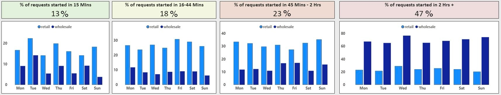
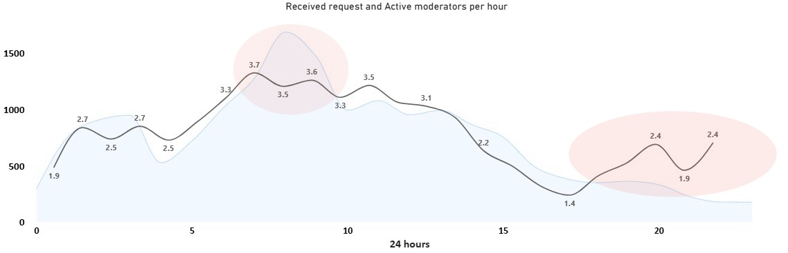
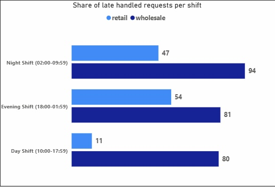
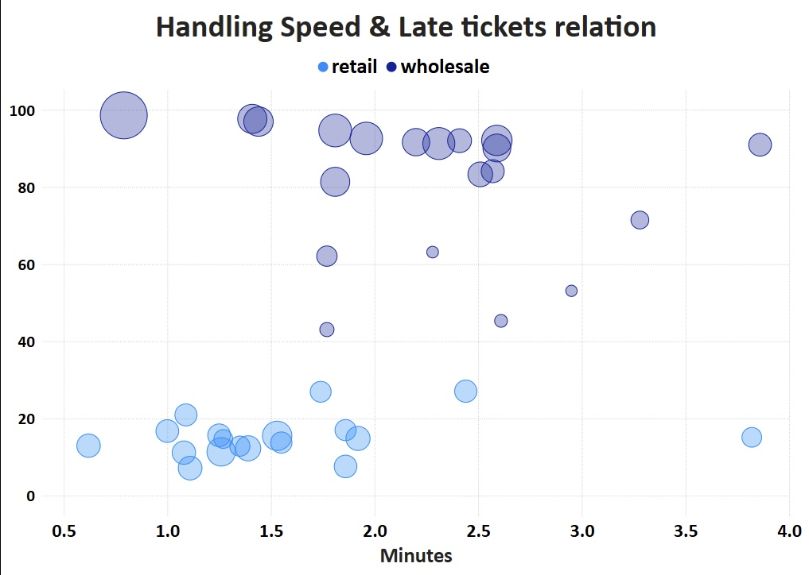
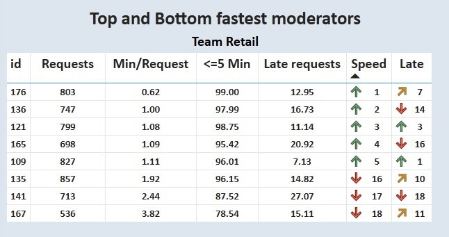
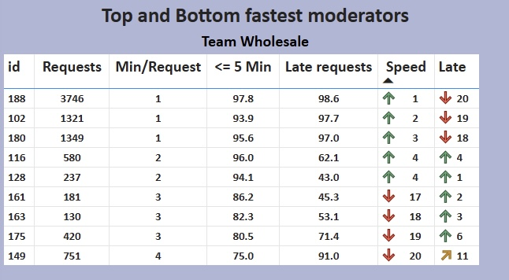

# support-team-performance-recommendations
Analysis of support performance for a dual-service marketplace. Identified performance gaps and understaffed shifts against strict SLAs. Recommended workforce scaling, schedule adjustments, and cross-team synergies to improve response times and overall customer satisfaction.

# The Analysis of Support Team Performance & Recommendations

## Section 1: The Core Issue: A Systemic Failure in Timeliness

Poor request handling is being driven by a critical failure to meet the SLAs. The data shows that response times are significantly longer than the internal goals.

**Key Findings:**

- **Critical Delays:** **47%** of all requests make customers wait **more than 2 hours** before an agent starts working on them. This represents a severe service failure for nearly half of the received requests.
- **SLA Failure:** We are meeting the primary 15-minute response time goal for only **13%** of requests.
- **Overall Performance:** In total, only **31%** of requests are addressed within the acceptable 45-minute threshold. This means over two-thirds of the customers are experiencing slow response times.

> Data Reference: These figures come from a full analysis of 35.44K valid requests handled by moderators with 7+ working days. The trend is consistent across the dataset, as detailed in the 3.1.1-daily-team-performance-summary.csv file, where the percent_wait_missed_daily column frequently shows critical values.

---

## Section 2: The Diagnosis: A Severe Mismatch Between Demand & Supply

The root cause of the long wait times might not be a shortage of staff, but a misalignment between the work schedules and the flow of customer requests.

**Key Findings:**

- **Peak Demand vs. Low Coverage:** Incoming requests (blue area) peak sharply between **7 AM and 9 AM**. During this critical window, we average only **3 to 3.5 active moderators** online (black line). This resource gap is the primary bottleneck in the system.
- **Poorly allocated Resources:** Agent activity remains high in the late afternoon and evening, when the volume of new requests is significantly lower. This indicates we can potentially **redistribute** the current staff from low-volume hours to cover the morning peak without immediate new hires.

> Data Reference: The 3.4.1-hourly-load-and-quality-by-team.csv file provides the data for this chart. The total_requests_hourly column confirms the 7-9 AM peak, while active_moderators_hourly shows the low coverage during that time.

---

## Section 3: The Consequence: Backlogs & The Night Shift Dilemma

Because there is a failure to handle requests during peak hours, a massive backlog accumulates. This creates a vicious delay cycle that is most visible during the night.

**Key Findings:**

- **Wholesale Team's Unattended Queue:** The data reveals a staggering issue for the Wholesale team. **94%** of the requests that are eventually handled during the Night Shift have already been waiting for **more than 2 hours**. This is definitive proof that the night team is not handling fresh requests but is instead working through a massive, aged backlog from previous hours.
- **The 2+ Hour Queue:** The 47% of tickets that wait over 2 hours form a persistent queue that clogs the system. While redistributing staff is the first step, a dedicated effort is needed to clear this backlog.
- **Recommendation:** We should explore hiring a small, dedicated **Evening or Night Shift team**. Their primary goal would be to clear the "2 Hrs +" queue, allowing the morning team to start fresh each day.

> Data Reference: The extreme nature of this backlog is visible in the 3.4.1-hourly-load-and-quality-by-team.csv data. For the Wholesale team at 5 AM, the avg_wait_time_minutes_hourly is 4,079 minutes (nearly 3 days), confirming these are old tickets.

---

## Section 4: A Tale of Two Teams: The Wholesale Challenge

Segmenting performance by team reveals that their different types of work may require different KPIs

**Key Findings:**

- **The Wholesale Correlation:** For the **Wholesale** team, there is a slight tendency that indicates some issues. The data shows that some of the fastest agents, like **#128**, are associated with a high rate of late tickets. This suggests that for Wholesale's more complex B2B issues, prioritizing speed may lead to unresolved tickets that re-enter the queue, ultimately increasing overall wait times.
- **The Retail Model:** In contrast, the **Retail** team shows a positive correlation. Their fastest agents, like **#176** (0.62 Min/Request, 99% efficiency), are also their best performers with very few late tickets. This indicates that Retail tickets are more transactional and benefit from speed.
- **Recommendation:** There should be further investigation into the complexity of Wholesale tickets. It might be worth reconsidering the 5 min handling time for the wholesale team to improve overall performance

> Data Reference: The 3.2.1-agent-performance-ranking-no-0-7-days.csv file provides the raw data for these tables, clearly showing the performance metrics for each agent.

---

## Section 5: The Untapped Potential: A First Look at New Moderators

As the previous data was based on the analysis of 38 moderators who had at least 7+ days within the working period, we also analyzed those who had been active more recently. The analysis of moderators with less than 7 days of work provides valuable insights. By focusing on those who have handled at least 8 requests, we get a reliable signal of early performance.

| Moderator ID | Team | Total Requests Handled | Avg Handling Time (Min) | % Handled ≤ 5 Min | % Wait Time ≤ 15 Min |
| --- | --- | --- | --- | --- | --- |
| 144 | Wholesale | 61 | 2.57 | 85.2% | 6.56% |
| 114 | Retail | 60 | 2.17 | 85.0% | 30.00% |
| 185 | Wholesale | 25 | 2.60 | 84.0% | 0.00% |
| 150 | Retail | 16 | 4.63 | 62.5% | 0.00% |
| **134** | **Retail** | **8** | **0.50** | **100%** | **100.00%** |

**Key Findings & Narrative:**

- **Early High-Performers Emerge:** From this group, we can already identify distinct performance patterns.
    - **Standout Talent (#134, Retail):** Moderator **#134** shows exceptional performance. On their first 8 requests, they achieved a perfect record: 100% of requests were picked up within 15 minutes, and their average handling time is an incredible **0.50 minutes**.
    - **Promising Starts (#114, Retail):** Moderator **#114** has handled a high volume (60 requests) while maintaining a high efficiency rate (85% ≤ 5 min) and a **30% "on time"** rate—more than double the experienced team's average.
- **Areas for Observation:** Conversely, some new hires are struggling. Moderator **#185 (Wholesale)** has a **100% "missed" rate** on 25 tickets, while **#150 (Retail)** has the slowest handling time in this group (4.63 mins).
- **Recommendation:** It is crucial to **track this cohort's performance** over the next 30-60 days. This will allow us to confirm early talent, provide targeted coaching where needed, and refine the onboarding process for all future employees.

> Data Reference: This analysis is based on the 2.2.2-operators_overall_summary_new.csv file, filtered to include only moderators who have handled 8 or more requests.

---

## Section 6: Summary & Suggestions

The analysis concludes that the core issue most probably is not a lack of staff, but misalignment of resources, schedules, and priorities. Here are the steps to consider:

**1. Realign Schedules (Immediate Priority)**

- **Action:** Shift agent schedules to provide maximum coverage during the **7 AM - 1 PM peak demand** window.
- **Reference:** This directly addresses the primary bottleneck identified in the "Demand vs. Supply" analysis (Section 2).

**2. Reinforce Off-Peak Hours to Clear Backlog**

- **Action:** Explore hiring a small, dedicated **Evening/Night Shift** team.
- **Reference:** This targets the **47%** of requests that wait over 2 hours and breaks the "backlog culture" revealed in the shift analysis (Section 3).

**3. Retrain & Re-evaluate KPIs**

- **Action:** For the **Wholesale** team, investigate ticket complexity and shift KPIs from pure speed to first-contact resolution. Implement a mentorship program led by top performers.
- **Reference:** This addresses the negative correlation between speed and late tickets for Wholesale (Section 4) and the 6x performance gap between agents.

**4. Nurture New Talent**

- **Action:** Closely monitor the performance of new hires to identify and develop high-potential individuals.
- **Reference:** This leverages the insights from the analysis of new hires (Section 5) to build a stronger team for the future.
